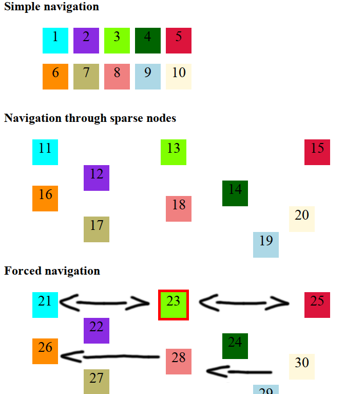

jquery.keyJumper
=============

A jQuery plugin to allow keyboard navigation through html nodes using arrow keys. It lets you define which nodes are selectable defining a class for the selected one. It has an algorithm to decide which is the nearest block but it lets you also select your preferred path forcing the navigation through the nodes you want.

Check out /examples for demo.